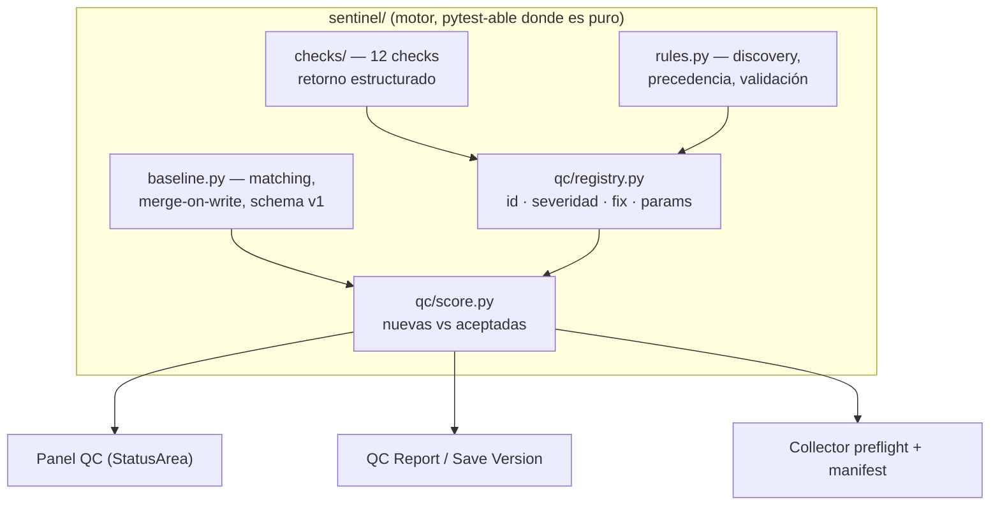
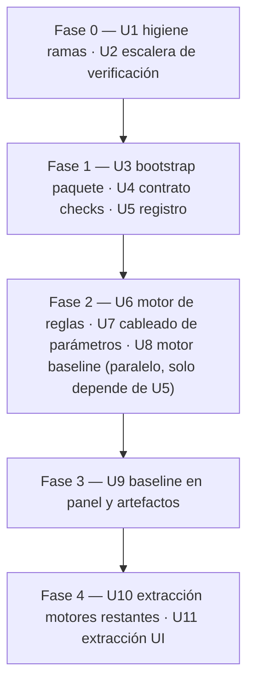

# feat: Motor QC 2.0 — registro, reglas por proyecto y baseline vía modularización incremental

## Summary

Modularizar Sentinel hacia un paquete `sentinel/` en fases que entregan, cada una, una capacidad nueva: contrato estructurado de resultados de los 12 checks, registro declarativo con severidad, `sentinel_rules.json` por proyecto y baseline de violaciones aceptadas por escena. La escalera de verificación (pytest + escenas fixture + runner) precede a la primera extracción y cierra cada fase.

---

## Problem Frame

Las escenas heredadas viven en rojo permanente (el panel deja de mirarse) y `standard_fps` es por máquina, así que dos artistas del mismo proyecto validan contra reglas distintas. Debajo: un `.pyp` de 11.067 líneas donde la lista de checks ya derivó una vez entre artefactos (commit `56b9461`), con 35% de motor mayormente puro atrapado junto a 57% de UI. Detalle completo en el documento origen (see origin: docs/brainstorms/2026-07-03-motor-qc-2-requirements.md).

---

## Requirements

Los requisitos R1–R19 del documento origen rigen este plan y no se reproducen aquí; cada unidad cita los que avanza. R20–R24 son nuevos, derivados del análisis de flujos de la planificación, y elaboran requisitos del origen:

- R20. Un check aprueba si tiene 0 violaciones nuevas; una fila mixta muestra "N nuevas (M aceptadas)". Las entradas de `_history.json` pasan a registrar `{passed, total, new, accepted}` con marcador de schema; las entradas anteriores se muestran como "8/12 (legacy)" para que la serie no se lea como mejora cuando solo cambió la métrica. (Elabora R7, R13.)
- R21. Un check desactivado por ruleset se muestra atenuado y reduce el denominador del score ("9/11 · 1 desactivado"); QC Report, resumen de versión y manifiesto del Collector listan los checks desactivados. (Elabora R9, R15.)
- R22. El sidecar de baseline usa merge-on-write (releer del disco, unir por identidad, escritura atómica); un sidecar ilegible bloquea escrituras hasta una lectura limpia y nunca se sobrescribe con contenido vacío. Al cargar, se detectan copias en conflicto de Synology (glob de hermanos "conflicted copy") y se fusionan por identidad con aviso — sin esto, la pérdida no es de segundos sino permanente y silenciosa. (Elabora R12.)
- R23. Scene Collector copia y renombra el sidecar de baseline igual que hace con el de notas, copia también el `sentinel_rules.json` efectivo a la carpeta de entrega (sin él, las aceptaciones paramétricas se re-arman al abrir la entrega fuera del proyecto), y el manifiesto lista las aceptaciones y el origen del ruleset. (Elabora R15.)
- R24. El sidecar de baseline lleva `"schema": 1` desde el primer día; las aceptaciones de checks paramétricos guardan un snapshot del parámetro de regla vigente y se re-arman si el ruleset lo cambia. (Elabora R12, R14.)

---

## Key Technical Decisions

- **Contrato estructurado de checks como fase propia y temprana:** los checks hoy devuelven listas de nombres o contadores (`check_render_conflicts` devuelve un int); el baseline necesita identidad por ítem y el registro necesita resultados uniformes. Se normaliza el retorno de los 12 checks a ítems estructurados `(check_id, identidad, mensaje)` con un adaptador que preserva el comportamiento de los consumidores actuales.
- **Patrón oficial de paquete Maxon:** `.pyp` como bootstrap (`sys.path.insert` de la carpeta del plugin, imports eager, `Register*` en el `.pyp`), paquete `sentinel/` con nombre único, `plugin/res/` intacto. Recarga soportada = reiniciar C4D, sin purga de `sys.modules`: purgar y re-importar crea split-brain con instancias vivas de ObjectData/TagData (el marker dibuja con el módulo viejo y el panel con el nuevo); estado obsoleto-pero-consistente es preferible.
- **Descubrimiento del ruleset:** carpeta de la escena (nivel 0) y hasta 3 ancestros (niveles 1–3); el fichero más cercano gana; sin merge entre niveles. Cuando un fichero más cercano eclipsa a otro dentro de la ventana, el header lo muestra ("shadows <ruta>") y el QC Report lista los eclipsados. Escena sin guardar → defaults con header "defaults (escena sin guardar)".
- **Fallback por clave en ruleset parcialmente inválido:** una clave inválida (`fps: "twenty"`) se rechaza con aviso único que la nombra; el resto del fichero aplica. Un typo no desactiva la configuración del proyecto entera.
- **Re-resolución del ruleset ligada a la caché QC:** la caché (cooldown 0,5 s) se invalida también por identidad + mtime del ruleset; editar o borrar el fichero surte efecto sin reiniciar (AE1 del origen).
- **Control de máquina anulado, visible:** cuando el ruleset del proyecto define un parámetro, el control per-máquina correspondiente se desactiva con caption "definido por ruleset del proyecto".
- **Identidad de baseline con índice de hermanos + GUID como desempate:** `check_id` + ruta jerárquica + índice entre hermanos homónimos (`/null/Cube[1]`), más el GUID del objeto (`GetGUID()`) almacenado en la entrada. Coincidencia de ruta con GUID distinto → re-armar, nunca suprimir: sin el GUID, borrar `Cube[0]` aceptado haría que `Cube[1]` heredara su aceptación en silencio. Reordenar re-arma (debilidad asumida, estilo RuboCop). Checks paramétricos usan el parámetro violado + snapshot de regla (R24). El check #12 usa `check_id + objeto + formato`, nunca frames.
- **Severidad solo visual en v1:** FAIL y WARN se formalizan en el registro pero ambos cuentan igual en el score (comportamiento actual); cambiar el peso queda para los gates.
- **Aceptar/retirar invalida la caché QC explícitamente:** una aceptación no cambia datos de escena, así que el dirty-flag no dispara; la acción invalida la caché para cumplir R16.
- **Autor obligatorio:** aceptar exige Artist Name no vacío (fallback: usuario del SO). Aceptar se deshabilita en escenas sin guardar (sin ruta de sidecar), como las notas.
- **Protocolo de re-baselining de fixtures:** un cambio intencional de comportamiento (consolidaciones R19) actualiza el JSON esperado solo en commit dedicado, separado de la extracción, con la justificación ítem a ítem; sin justificación, la consolidación se difiere.
- **Runner de fixtures dentro de C4D:** los checks importan `c4d`; el runner corre como script en C4D (o `c4dpy` si está disponible en el seat). Fixtures `.c4d` + JSON esperado versionados en el repo.
- **El instalador debe copiar el paquete:** `INSTALL_SENTINEL.bat` y la instalación manual pasan de copiar un fichero a copiar `sentinel_panel.pyp` + `sentinel/` + `res/`; se documenta desde la fase 1.

---

## High-Level Technical Design

Arquitectura objetivo (capas y consumidores):

Secuencia de fases (cada una cierra con el runner de fixtures en verde):

---

## Implementation Units

### U1. Higiene de ramas: WIP fuera de main

- **Goal:** `main` queda limpio y verificable antes de tocar arquitectura; el WIP de v1.5.8 + v1.6.0 vive en una rama propia con destino decidido.
- **Requirements:** dependencia de la auditoría (see origin: Dependencies).
- **Dependencies:** ninguna.
- **Files:** operaciones git; sin cambios de código.
- **Approach:** el WIP (commit `95c181b`, único y mixto: Preserve Vertical + Camera Frame) NO está pusheado — verificado: `main` local va 7 commits por delante de `origin/main`. Una sola rama `wip/v1.5.8-v1.6.0-combined` (dividir el commit mixto no compensa); `main` local queda en `56b9461` (v1.5.7 + unificación QC) y se pushea. Decisión de reintegración: el WIP se re-aterriza sobre la estructura nueva después de U11 (rebase o re-implementación parcial asumida) — por eso U11 mueve `overlay.py` al final; si el usuario prefiere verificar y aterrizar el WIP antes de U10, es el único punto de entrada alternativo.
- **Test scenarios:** Test expectation: none — operación de repo sin cambio de comportamiento.
- **Verification:** el plugin en `main` carga en C4D 2026 y el panel funciona; la rama WIP conserva los cambios íntegros; `origin/main` actualizado.

### U2. Escalera de verificación: pytest + fixtures + runner

- **Goal:** red de regresión ejecutable: helpers puros bajo pytest y los 12 checks comparados contra JSON esperado sobre escenas fixture.
- **Requirements:** R17, R18; AE5.
- **Dependencies:** U1.
- **Files:** `tests/` (pytest para helpers puros), `tests/fixtures/` (escenas `.c4d` violadora + limpia + JSON esperado), `tests/c4d_runner/run_fixtures.py` (script para Script Manager / c4dpy), `README.md` (cómo ejecutar).
- **Approach:** capturar primero el comportamiento v1.5.7 real: construir la escena violadora (≥1 violación por check, incluidos casos límite conocidos como `relative://`), ejecutar los 12 checks, congelar el resultado como JSON esperado. Mecanismo del runner pre-extracción: cargar el `.pyp` vía `SourceFileLoader` (el registro está protegido por `if __name__ == "__main__"`, verificado — no hay doble registro; el runner obtiene su propia instancia de `check_cache`, inocuo). El runner es una sola acción (script que carga ambas fixtures, corre los 12 checks, compara y emite PASS/FAIL) — la fricción de un runner manual multipaso degrada a "correr al final de fase", que es donde una regresión se vuelve cara de bisecar; intento timeboxed de `c4dpy` al principio, no al final. Independencia de máquina: el runner inyecta un `standard_fps` fijo y las fixtures usan rutas de textura relativas (o la comparación normaliza separadores) para que el JSON congelado no difiera entre macOS/Windows ni entre settings. Los helpers puros existentes (parseo de versiones, matemática de crops, clasificación de rutas) reciben tests directos.
- **Execution note:** characterization-first — el JSON esperado documenta el comportamiento actual, no el deseado.
- **Test scenarios:**
  - Runner sobre escena violadora → 12/12 checks con las violaciones esperadas exactas.
  - Runner sobre escena limpia → 12/12 OK.
  - Covers AE5. Runner tras cualquier fase de extracción → idéntico al JSON congelado.
  - pytest: parseo `robot_v007_TR.c4d` → (base, 7, "TR"); crop 9:16 con insets asimétricos → rectángulo esperado; clasificación `relative://tex.png` → asset_uri.
- **Verification:** `pytest` verde local; runner reporta comparación limpia en C4D 2026 sobre ambas fixtures.

### U3. Bootstrap del paquete `sentinel/` + extracción de riesgo bajo

- **Goal:** el `.pyp` queda como bootstrap y los primeros módulos sin acoplamiento UI viven en el paquete.
- **Requirements:** R1, R2, R3, R4.
- **Dependencies:** U2.
- **Files:** `plugin/sentinel_panel.pyp` (reducido a bootstrap), `plugin/sentinel/__init__.py`, `plugin/sentinel/common/{settings.py,cache.py,helpers.py,constants.py}`, `INSTALL_SENTINEL.bat`, `INSTALLATION_README.md`.
- **Approach:** patrón oficial: insert de `sys.path`, imports eager de todos los submódulos, `Register*` permanece en el `.pyp`; SIN purga de `sys.modules` (ver KTD: split-brain con overlays vivos) — política de recarga: reiniciar C4D. Migran `GlobalSettings`, `CheckCache`, helpers de iteración y constantes. El instalador pasa a copiar carpeta completa.
- **Patterns to follow:** Maxon Python Libraries Manual (2026) — patrón insert/import/pop; renderEngine local como ejemplo de paquete consumido desde C4D.
- **Test scenarios:**
  - Covers AE5. Runner de fixtures idéntico al JSON congelado tras la extracción.
  - Instalación limpia desde el instalador en máquina con C4D 2026 → plugin aparece y panel abre.
  - Tras "Reload Python Plugins" con una escena con overlay abierta, el toggle del panel sigue gobernando el overlay visible (sin split-brain); la política documentada es reiniciar C4D.
- **Verification:** plugin carga sin errores; overlay Safe-Area y Camera Frame se registran igual (res/ intacto); fixtures verdes.

### U4. Contrato estructurado de resultados de los 12 checks

- **Goal:** todo check devuelve ítems estructurados `(check_id, identidad, mensaje)`; los consumidores actuales producen exactamente la misma salida a través de un adaptador.
- **Requirements:** R2, R5 (prerequisito), R14 (identidad por ítem).
- **Dependencies:** U3.
- **Files:** `plugin/sentinel/checks/` (un módulo por grupo de checks), `plugin/sentinel/qc/results.py` (modelo de resultado + adaptador), `tests/` (tests del adaptador).
- **Approach:** definir el modelo de violación (check con objetos → ruta jerárquica + índice de hermanos + GUID; check paramétrico → nombre de parámetro + valor). Migrar los checks al paquete por grupos en commits separados (no los 12 de golpe), convirtiendo su retorno; `_build_qc_summary` y `_CHECK_DISPLAY` consumen el modelo vía adaptador que reproduce los formatos actuales ("{n} lights outside…", listas de nombres). Sin cambiar la lógica de detección. Los valores cacheados en `check_cache` adoptan la forma estructurada (caché solo-runtime; sin problema de invalidación). **Oráculo:** el JSON de texto congelado de v1.5.7 sigue siendo el oráculo primario durante toda la migración — el runner compara la salida del adaptador contra él SIN cambios en los mismos commits que migran checks; el oráculo estructurado se añade como segundo oráculo en commit posterior dedicado. Nunca se cambia implementación y oráculo en el mismo commit.
- **Test scenarios:**
  - Covers AE5. Salida del adaptador byte-idéntica al JSON congelado de v1.5.7 tras cada commit de migración por grupo; el oráculo estructurado se añade después, en commit dedicado.
  - Dos hermanos "Cube" bajo el mismo padre → identidades distintas `Cube[0]` / `Cube[1]`.
  - `check_render_conflicts` (hoy un int) → n ítems con identidad de preset.
  - Adaptador: para cada check, texto del panel y del QC Report byte-idéntico a v1.5.7.
- **Verification:** fixtures verdes con el nuevo modelo; panel visualmente idéntico sobre las escenas fixture.

### U5. Registro declarativo de checks

- **Goal:** los 12 checks son entradas de un registro (id, etiqueta, severidad FAIL/WARN, capacidad de fix, params) y los cuatro consumidores lo iteran.
- **Requirements:** R5, R6, R7.
- **Dependencies:** U4.
- **Files:** `plugin/sentinel/qc/registry.py`, `plugin/sentinel/qc/score.py`, ajustes en panel/QC Report/resumen de versión/Collector preflight, `tests/`.
- **Approach:** formalizar `_CHECK_DISPLAY` + `ROW_KEYS` en el registro; severidad = los FAIL/WARN actuales, solo display en v1. `run_all_checks(doc)` a nivel de módulo devuelve resultados estructurados por entrada del registro (sustituye la orquestación en estado de instancia de `_refresh`).
- **Test scenarios:**
  - Entrada dummy #13 añadida en un test → aparece en los cuatro consumidores sin editarlos; retirada, desaparecen.
  - Orden del panel y score idénticos a v1.5.7 con defaults (fixtures).
  - Registro con ids duplicados → error de carga explícito (defensa de desarrollo).
- **Verification:** fixtures verdes; los cuatro artefactos consumen el registro (grep: cero referencias residuales a la lista antigua).

### U6. Motor de reglas: `sentinel_rules.json`

- **Goal:** descubrimiento, validación y precedencia de reglas por proyecto, como módulo puro testeable.
- **Requirements:** R8, R11; AE6.
- **Dependencies:** U5.
- **Files:** `plugin/sentinel/rules.py`, `tests/test_rules.py`.
- **Approach:** búsqueda ascendente ≤3 niveles desde la carpeta de la escena, el más cercano gana, sin merge entre ficheros; precedencia proyecto > settings de máquina > defaults embebidos. Validación por clave con lista de claves rechazadas. Resolución cacheada por (ruta, mtime), invalidada junto a la caché QC. Escena sin guardar → defaults.
- **Test scenarios:**
  - Rules en carpeta de escena y en raíz de proyecto → gana el de la escena.
  - Rules a 4 niveles → no se encuentra (límite 3).
  - Covers AE6. JSON corrupto → defaults + aviso; `fps: "twenty"` → resto del fichero aplica, clave rechazada nombrada.
  - Sin fichero y sin setting de máquina → defaults embebidos.
  - Cambio de mtime → re-resolución en el siguiente refresco.
  - Escena sin ruta → defaults con motivo "unsaved".
- **Verification:** pytest de discovery/validación verde sin C4D (paths sintéticos); fixtures QC intactas sin fichero de reglas.

### U7. Cableado de parámetros y UI del ruleset

- **Goal:** los checks leen sus parámetros del contexto de reglas; el header muestra el ruleset activo; los checks desactivados salen del denominador.
- **Requirements:** R9, R10, R21; AE1.
- **Dependencies:** U6.
- **Files:** `plugin/sentinel/checks/*` (lectura de params), `plugin/sentinel/qc/score.py` (denominador), header del panel y diálogo de settings en el `.pyp`/UI, `tests/fixtures/` (tercera pareja: escena + `sentinel_rules.json` + JSON esperado).
- **Approach:** parámetros v1: FPS, frame inicial, presets aprobados, nombres por defecto, insets de safe-area, severidad por check, on/off. El control per-máquina de FPS se desactiva con caption cuando el proyecto lo define. Fila de check desactivado atenuada; artefactos listan los desactivados (R21).
- **Test scenarios:**
  - Covers AE1. Rules con `fps: 24` junto a la escena → QC #11 acepta 24; borrar el fichero → 25 sin reiniciar.
  - Preset extra aprobado en rules → QC #5 lo acepta.
  - Check `names` desactivado → header "X/11 · 1 desactivado"; QC Report lo lista como desactivado.
  - Dos instalaciones (simulado: dos settings de máquina distintos) + mismo rules → mismo resultado.
  - Severidad de `names` cambiada a FAIL en rules → orden/color del panel cambia; score no (severidad solo visual).
- **Verification:** fixture con rules produce el JSON esperado; header refleja nombre y origen del ruleset en C4D.

### U8. Motor de baseline: sidecar y matching

- **Goal:** persistencia y matching de aceptaciones como módulo puro: schema v1, identidad, merge-on-write, entradas obsoletas.
- **Requirements:** R12, R14, R22, R24.
- **Dependencies:** U5 (identidad estructurada); paralelizable con U6–U7.
- **Files:** `plugin/sentinel/baseline.py`, `tests/test_baseline.py`.
- **Approach:** `<base>_baseline.json` compartido por escena base (patrón del sidecar de notas, `get_notes_path`); entradas `{check_id, identity, param_snapshot?, author, reason, date}` + `"schema": 1`. Merge-on-write: releer, unión por identidad, escritura atómica (tmp + rename). Carga fallida → modo solo-lectura del baseline (bloquea escrituras, nunca sobrescribe). Matching separa violaciones en nuevas/aceptadas/obsoletas (aceptación sin violación actual).
- **Test scenarios:**
  - Aceptar 5 → matching reporta 0 nuevas; violación nueva → 1.
  - Covers AE3. Renombrar objeto → su aceptación pasa a obsoleta y la violación a nueva; para checks paramétricos (FPS) la identidad es el parámetro, no la ruta — permanece aceptada hasta que el parámetro o su regla cambien.
  - Borrar `Cube[0]` aceptado con `Cube[1]` hermano → `Cube[1]` NO hereda la aceptación (GUID distinto → re-armar).
  - Snapshot de parámetro: aceptación de FPS con snapshot 25 + rules pasa a 24 → re-armada.
  - Merge concurrente: A acepta x, B acepta y sobre copias divergentes → escritura de B conserva ambas.
  - Copia en conflicto de Synology junto al sidecar → detectada al cargar, fusionada por identidad, aviso mostrado.
  - JSON truncado → carga falla, escritura bloqueada, fichero intacto en disco.
  - Identidad #12: mismo objeto, formatos distintos → entradas independientes; frames excluidos de la identidad.
- **Verification:** pytest verde sin C4D (sidecars sintéticos).

### U9. Baseline en el panel y en los artefactos

- **Goal:** aceptar/retirar desde el panel; score de solo-nuevas; los tres artefactos reportan nuevas + aceptadas; Collector transporta el sidecar.
- **Requirements:** R13, R15, R16, R20, R23; AE2, AE3, AE4.
- **Dependencies:** U8.
- **Files:** panel (StatusArea + acciones), `plugin/sentinel/qc/score.py`, exportador de QC Report, resumen de Save Version, Scene Collector, `tests/fixtures/` (pareja con baseline).
- **Approach:** acción Accept con motivo obligatorio (autor de Artist Name, fallback usuario SO; deshabilitada sin escena guardada); fila "N nuevas (M aceptadas)" con recuento expandible que incluye obsoletas con purga; aceptar/retirar invalida la caché QC. Historia pasa a `{passed, total, new, accepted}`. Collector copia y renombra el sidecar como el de notas y lista aceptaciones en el manifiesto.
- **Test scenarios:**
  - Covers AE2. Escena con 5 violaciones → aceptar 5 con motivo → score 0 nuevas, "5 aceptadas"; nueva violación → contador 1.
  - Covers AE3. Retirar una aceptación → check re-armado en el siguiente refresco (caché invalidada).
  - Covers AE4. QC Report y manifiesto listan aceptadas con autor y motivo junto a las nuevas.
  - Check con 3 violaciones, 2 aceptadas → fila roja "1 nueva (2 aceptadas)"; con 3 aceptadas → fila verde con badge.
  - Collect Scene de `robot_010_v022_FINAL` → entrega contiene `robot_010_baseline.json` y el `sentinel_rules.json` efectivo; reabrir la entrega conserva aceptaciones (incluidas las paramétricas) y el score del manifiesto se reproduce.
  - Historia con entradas de las dos eras → las antiguas se muestran "8/12 (legacy)", las nuevas con new/accepted.
  - Escena sin guardar → botón Accept deshabilitado con hint.
  - Save Version v007→v008 → mismas aceptaciones visibles (sidecar por base).
- **Verification:** fixture con baseline produce el split nuevas/aceptadas esperado; recorrido manual en C4D del flujo aceptar→compartir→retirar.

### U10. Extracción de motores restantes + consolidaciones

- **Goal:** texturas, versionado, multi-formato, safe-areas, notas y AOVs migran al paquete; la única consolidación en alcance es la de los tres clasificadores de rutas de texturas (allow-list de R19) — cualquier otro candidato requiere pasar el mismo gate de diff justificado antes de entrar.
- **Requirements:** R2, R19.
- **Dependencies:** U5 (patrón asentado); ejecutable en paralelo con U6–U9 por módulos.
- **Files:** `plugin/sentinel/{textures.py,versioning.py,multiformat.py,safe_areas.py,notes.py,aovs.py}`, `tests/`.
- **Approach:** un commit por módulo siguiendo el patrón U3/U4 (mover, adaptar imports, fixtures verdes). Consolidación de los tres clasificadores de rutas de texturas solo con cobertura previa y JSON esperado actualizado en commit dedicado con justificación ítem a ítem; sin justificación → diferida. El singleton `_overlay_state` y los ObjectData/TagData no se tocan (quedan con la UI).
- **Test scenarios:**
  - Covers AE5. Fixtures idénticas tras cada commit de módulo.
  - Consolidación de clasificadores: suite previa que fija el comportamiento de los tres sobre el corpus de rutas (absolutas, `relative://`, UNC de Windows, ausentes) y diff justificado si cambia.
  - Test expectation por módulo sin cambio de comportamiento: fixtures + pytest de sus helpers.
- **Verification:** `plugin/sentinel_panel.pyp` reducido a bootstrap + UI; motor completo importable sin abrir el panel.

### U11. Extracción de la capa UI y cierre

- **Goal:** diálogos, user areas y el panel migran a `sentinel/ui/`; el `.pyp` queda mínimo; documentación actualizada.
- **Requirements:** R1, R2, R3.
- **Dependencies:** U9, U10.
- **Files:** `plugin/sentinel/ui/{panel.py,dialogs.py,user_areas.py,ids.py,overlay.py}`, `plugin/sentinel_panel.pyp` (final), `CLAUDE.md` (estructura y flujo de desarrollo), `README.md`.
- **Approach:** migrar por goteo: user areas → diálogos modales → `YSPanel` al final. Las clases ObjectData/TagData (overlay, Camera Frame) y `_overlay_state` migran juntas a `ui/overlay.py` con el registro aún en el `.pyp`. Sin rediseño de la UI: mover, no mejorar.
- **Test scenarios:**
  - Covers AE5. Fixtures verdes tras cada migración parcial.
  - Recorrido manual de la checklist de humo de CLAUDE.md: 4 tabs, overlay dibuja, Texture Repathing abre, Save Version y Collect funcionan.
  - "Reload Python Plugins" + reinicio C4D → sin clases duplicadas, overlay operativo.
- **Verification:** `.pyp` final < ~200 líneas (bootstrap + registro); checklist de humo completa en macOS y Windows.

---

## Scope Boundaries

**Deferred to Follow-Up Work**

- Quality gates en Save FINAL / Collect (consumirán la severidad del registro).
- Severidad de doble contexto (trabajo vs. entrega) y peso de severidad en el score.
- Caducidad de aceptaciones del baseline; aviso al hacer "Save As" con base nueva (huérfano de sidecar).
- Ediciones/versionado formal del ruleset.
- Polling de mtime del sidecar para detectar aceptaciones sincronizadas de un compañero en mitad de sesión (v1: se recogen al refrescar/reabrir).

**Outside this product's identity**

- Reescritura desde cero o C++; cualquier dependencia de servidor (see origin).

---

## Risks & Dependencies

- **Mover historia publicada en U1:** si el WIP ya está en `main` remoto, retroceder exige coordinación — confirmar con el usuario antes de forzar nada.
- **Regeneración del JSON esperado en U4:** el paso de textos a ítems estructurados obliga a re-baselinar una vez; el protocolo (commit dedicado + diff justificado) es la mitigación, pero es el punto con más riesgo de esconder una regresión real.
- **Synology y escrituras atómicas:** `tmp + rename` sobre carpetas sincronizadas genera copias en conflicto cuando dos réplicas divergen; sin detección, la pérdida es permanente y silenciosa (el fichero es legible, el lockout de R22 no dispara). Mitigación: detección + fusión de conflicted copies al cargar (R22); el residuo aceptado para 2-5 personas es la ventana de staleness mid-sesión (polling de mtime diferido).
- **`c4dpy` no garantizado por seat:** el runner debe funcionar como script de Script Manager como camino principal; `c4dpy` es optimización.
- **Fatiga de fase:** 11 unidades es un arco largo; cada fase entrega valor usable (U5 registro, U7 reglas, U9 baseline) para poder pausar sin quedar a medias.

---

## Sources & Research

- Origen: `docs/brainstorms/2026-07-03-motor-qc-2-requirements.md` (R1–R19, decisiones y AEs).
- Mapa estructural del `.pyp` (sesión 2026-07-03): rangos de líneas por región, acoplamientos (`YSPanel.Command()` ~600 líneas; `_overlay_state`), distribución 35/57/8.
- Análisis de flujos (sesión 2026-07-03): 28 hallazgos; los 10 plan-blocking resueltos en KTDs/R20–R24.
- `plugin/sentinel_panel.pyp:7228` (`_CHECK_DISPLAY`), `:2817` (`_build_qc_summary`), `:3180` (`get_notes_path`, patrón de sidecar a imitar).
- Maxon Python Libraries Manual (C4D 2026) — patrón de paquete y comportamiento de recarga; ejemplos locales (`renderEngine`) como referencia de estructura.
- `docs/audit/2026-06-12_supervisor_audit.md` — mandato verificar-antes-de-construir; anti-patrón "confianza falsa".
