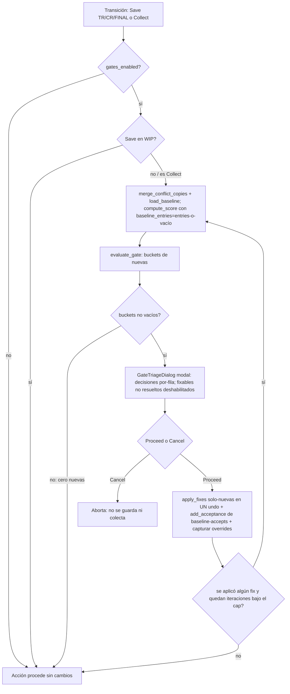

# feat: Quality Gates en Save FINAL y Collect Scene (I3)

## Summary

Añadir un *quality gate* opt-in que intercepta las dos transiciones irreversibles del flujo —guardar una versión con estado TR/CR/FINAL y Collect Scene— y, cuando está activado por ruleset, presenta un diálogo de triaje bloqueante antes de la acción: los fallos sin auto-fix bloquean (o se anulan con motivo, registrado con autor y fecha, o se aceptan en el baseline), los corregibles ofrecen "Fix & continue" en un solo undo, y los avisos requieren un "continuar igualmente" explícito. El gate no ejecuta checks nuevos: consume el veredicto de `compute_score` sobre el registro canónico de 12 checks, contando solo violaciones **nuevas** (no baselined). Por defecto está desactivado, así que el comportamiento consultivo actual de v1.6.0 no cambia.

---

## Problem Frame

v1.6.0 (Motor QC 2.0) formalizó severidad (FAIL/WARN), capacidad de fix (`has_fix`) y el split nuevas-vs-aceptadas en el registro, pero el panel sigue siendo puramente consultivo: nada obliga a mirarlo. El fallo real y documentado por la auditoría de junio es entregar (Collect) o sellar un review (FINAL) con una escena que aún falla QC. I3 fue explícitamente diferido por el plan de Motor QC 2.0 como el consumidor de la severidad recién formalizada (see origin: ideación #i3; `docs/plans/2026-07-03-001-feat-motor-qc-2-plan.md` Scope Boundaries).

El anti-patrón nombrado por la auditoría —"confianza falsa"— es el riesgo central: un gate que bloquea entregas es el consumidor de mayor riesgo de la lista de checks. Si su veredicto diverge del panel (sublista propia, sidecar sin recuperar), negará entregas que el panel aprueba o al revés (`docs/audit/2026-06-12_supervisor_audit.md`, Risk #1). Por eso el gate debe computar su score por la **misma ruta con recuperación** que el panel.

---

## Requirements

### Opt-in y compatibilidad

- R1. Con `gates_enabled` desactivado (default), Save Version y Collect Scene se comportan exactamente igual que en v1.6.0: sin gate, sin diálogo.
- R2. `gates_enabled` se lee a través del ruleset con precedencia proyecto > máquina > default (OFF); un valor inválido se rechaza por-clave con aviso nombrado sin desactivar el resto del fichero.
- R3. Save Version en estado WIP nunca dispara el gate (solo TR/CR/FINAL); Collect Scene siempre lo evalúa cuando está activado.

### Clasificación del veredicto

- R4. El gate deriva su veredicto de `compute_score` sobre `CHECK_REGISTRY`, por la misma ruta con recuperación de conflict-copies que el panel, forzando el split nuevas-vs-aceptadas (vía `baseline_entries`) incluso sin sidecar en disco — nunca de una sublista propia. Es el cuarto consumidor del registro canónico.
- R5. El gate clasifica cada check con violaciones nuevas por fixabilidad y severidad: `has_fix` → CORREGIBLE; FAIL sin fix → BLOQUEANTE; WARN sin fix → AVISO. Un check bloquea la entrega sii su severidad efectiva es FAIL.
- R6. Solo las violaciones **nuevas** disparan el gate; las baselined (aceptadas) y las de checks desactivados por ruleset quedan fuera. Una escena con cero nuevas procede sin diálogo.

### Acciones del gate

- R7. Cada check bloqueante se resuelve por-fila: (a) "anular con motivo" —registrado con `{check_id, identity, author, reason, date}` en la entrada de historial (Save) o el manifiesto (Collect), **no** como aceptación del baseline— o (b) "aceptar en baseline", que escribe una aceptación permanente vía `add_acceptance`. Un único campo de motivo compartido aplica a todas las anulaciones de la invocación.
- R8. Los CORREGIBLE ofrecen "Fix & continue": aplicar los auto-fixes seleccionados ocurre como **un solo paso de undo** y actúa **solo sobre las violaciones nuevas**, tras lo cual el gate re-evalúa (bucle acotado, KTD8).
- R9. Los AVISO requieren un "continuar igualmente" explícito (sin motivo obligatorio).

### UX y verificación

- R10. El diálogo de triaje es modal confirm-and-close (espeja `BaselineActionDialog`): los fixes se aplican y el diálogo cierra antes de que proceda el guardado. Cada re-evaluación abre una **instancia nueva** del diálogo. El gate nunca procede en silencio con un FAIL nuevo sin resolver.
- R11. La lógica pura del gate (clasificación, evaluación, construcción del registro de anulación, clave de identidad y filtrado a solo-nuevas) se cubre con pytest sin `import c4d`; el comportamiento bloqueo/fix/anulación se verifica en C4D vivo vía el runner de fixtures.

---

## Key Technical Decisions

- KTD1 — El gate computa el score por la misma ruta con recuperación que el panel, forzando baseline-aware con `baseline_entries`. Dos requisitos que hay que satisfacer a la vez: (a) **siempre** producir el split nuevas-vs-aceptadas (aun sin sidecar), y (b) **recuperar** las conflict-copies de Synology igual que el panel. `compute_score` solo devuelve `new_counts`/`baseline_matches` cuando corre `_baseline_score`; pasar un `baseline_path` de fichero ausente degrada a `_legacy_score` (fail-open); pero pasar `baseline_entries` sin más **salta** la recuperación de conflict-copies que vive en la rama `baseline_path` de `_load_baseline_entries` (`score.py:121-137`) — y sin ella, en SynologyDrive el gate bloquearía entregas que el panel aprueba (el sidecar principal corrupto/vacío + la copia-conflicto con las aceptaciones reales). Solución: el gate hace la recuperación explícita y luego pasa `baseline_entries`: `path = baseline.get_baseline_path(doc_path)`; `baseline.merge_conflict_copies(path)` (repara el sidecar en disco, igual que el panel); `entries, status = baseline.load_baseline(path)`; `gate_entries = entries if status == baseline.STATUS_OK else []`; `compute_score(registry_results, rules_context, baseline_entries=gate_entries, current_params=...)`. Verificado: `score.py:224` usa `if baseline_path or baseline_entries is not None:` (chequeo de identidad, no truthiness — `[]` entra correctamente) y `_load_baseline_entries` (`score.py:114-116`) devuelve `(list([]), STATUS_OK)`, así que `[]` fuerza baseline-aware con todo como nuevo. Esto cierra "confianza falsa" y alinea el gate con el panel.

- KTD2 — Clasificación por fixabilidad + severidad. `classify_gate(entry, rules_context)` devuelve `(nivel, blocks)` con `blocks = (entry_severity(entry, rules_context) == "FAIL")`: `has_fix=True` → CORREGIBLE; `has_fix=False` + FAIL → BLOQUEANTE; `has_fix=False` + WARN → AVISO. Esto evita que `unused_mats` (WARN + `has_fix=True`) quede como AVISO sin fix. Un CORREGIBLE con fix declinado se pliega por severidad: FAIL → requiere override/baseline; WARN → basta acknowledge. Los 4 checks con fix: `lights`(FAIL), `cam`(FAIL), `unused_mats`(WARN), `fps_range`(FAIL). Nota: el enum de severidad de Sentinel es `{FAIL, WARN}` (`rules.py:18`); el "FATAL" de la ideación mapea a FAIL-sin-fix.

- KTD3 — La anulación es un registro de auditoría por-entrega; el diálogo ofrece además aceptar en baseline (salvo sidecar corrupto). `build_override_records(new_violations, author, reason)` devuelve dicts `{check_id, identity, author, reason, date}` (forma de `entry_from_violation`) escritos en historial (Save) / manifiesto (Collect) **sin** `add_acceptance`. "Aceptar en baseline" (por-fila) enruta a `add_acceptance` para convertir un override crónico en aceptación permanente. **Salvaguarda INVALID:** si el gate corrió sobre un sidecar corrupto (`STATUS_INVALID`), "Aceptar en baseline" se **deshabilita** en el diálogo — `add_acceptance` sobre un sidecar inválido retorna `False` sin escribir (`baseline.py:69`), así que la aceptación se perdería en silencio y la violación FAIL escaparía sin rastro; en ese estado la fila solo admite override (registro durable) o cancelar. Ambos —overrides y baseline-accepts— quedan visibles al supervisor: overrides en historial/manifiesto, baseline-accepts en el bloque `baseline`/`acceptances` del manifiesto.

- KTD4 — Diálogo modal confirm-and-close, no async. El gate es una decisión bloqueante por naturaleza; los fixes se aplican, el diálogo cierra, y entonces procede el save/collect. Patrón a espejar: `BaselineActionDialog` (`plugin/sentinel/ui/dialogs.py:212`).

- KTD5 — "Fix & continue" batchea en un `StartUndo`/`EndUndo` y filtra a solo-nuevas por **clave de identidad hashable**. Extraer el cuerpo interno de cada fixer (`_apply_*`, sin wrapping) y un runner `apply_fixes(doc, fixes)` con **un** bracket; los wrappers públicos `fix_*` se conservan. El filtrado a nuevas es objeto→identidad, pero `baseline_matches[check_id]["new"]` son violaciones cuyo campo `identity` es un **dict no hashable** — construir `set(v["identity"] ...)` lanza `TypeError`. Se define una **clave canónica hashable** de la identidad (promover el helper existente `baseline._entry_key` a público, o `json.dumps(identity, sort_keys=True)`) y se aplica idénticamente en ambos lados: el set de nuevas se construye con esa clave, y por cada objeto vivo de la lista legacy se computa `results.object_identity(obj)`/`material_identity(mat)` → misma clave → se conserva si está en el set. Helper `filter_to_new(live_objects, new_keys, identity_fn, key_fn)` en `gate.py` (puro). Excepción: `fix_fps_range` re-normaliza **todos** los presets (no filtrable — ver Risks). Precedente de batch: `TextureRepathingDialog._do_apply_all` (`dialogs.py:1331-1364`).

- KTD6 — Opt-in vía `gates_enabled` en `DEFAULTS` (default `False`). El sistema de reglas descarta claves que no estén en `DEFAULTS` (`rules.py` `_apply_source`), así que la clave se añade ahí; la validación entra como rama en `_validate_key`.

- KTD7 — `evaluate_gate(score_summary, rules_context)` es puro y se apoya en la garantía de KTD1. Itera **las claves de `baseline_matches`/`new_counts`** (checks habilitados con evaluación), no `CHECK_REGISTRY` crudo — un check desactivado por ruleset se salta con `continue` en `score.py:182-184` y no entra en `new_counts`, así que subíndice directo daría `KeyError`; usar `new_counts.get(check_id, 0)`. Para cada check con nuevas>0 toma `baseline_matches[check_id]["new"]`, clasifica, y devuelve buckets de items con forma `{check_id, nivel, blocks, new_count, violations}`. `passed = True` sii los tres buckets están vacíos. Sin `import c4d`.

- KTD8 — Bucle "Fix & continue → re-evaluar" acotado, con estado terminal explícito. (1) **Terminación:** cap duro = nº de checks fixables al inicio; cada iteración abre una **instancia nueva** de `GateTriageDialog` en un `while` del seam. (2) **Robustez:** no se mide "sin cambios" por identidad (un fix la muta — `fix_lights` mueve el objeto, `panel.py:437`); se compara por **count-per-check**: el seam recuerda qué fixables intentó en la iteración, y si tras el fix el `new_count` de ese check no bajó, ese check queda **deshabilitado** (checkbox gris + etiqueta inline "Fix no resolvió esta violación — requiere anular o aceptar en baseline"). (3) **Efectos colaterales:** un fix puede subir el count de OTRO check (los fixers mutan estado global); el cap garantiza terminación igualmente, pero la resolución no está garantizada. (4) **Estado terminal:** al salir del bucle (cap alcanzado o solo quedan no-fixables), si persiste algún FAIL nuevo el gate **sigue BLOQUEANTE** — "Proceed" exige resolver cada FAIL restante por override/baseline por-fila, o Cancelar; nunca procede en silencio.

---

## High-Level Technical Design

Flujo del gate en cada seam (idéntico salvo el guard de estado, que solo aplica a Save). El límite de iteraciones es la guarda del `while` del seam, no una rama de datos:

Mapeo fixabilidad + severidad → nivel del gate:

| `has_fix` | `entry_severity` | Nivel | `blocks` | Acción ofrecida (por fila) |
|---|---|---|---|---|
| True | (cualquiera) | CORREGIBLE | `= (entry_severity == "FAIL")` | Fix & continue; al declinar: override/baseline (FAIL) o acknowledge (WARN) |
| False | FAIL | BLOQUEANTE | True | Anular con motivo, Aceptar en baseline, o Cancelar |
| False | WARN | AVISO | False | Continuar igualmente |

---

## Implementation Units

### Phase 1 — Núcleo puro-Python (sin C4D, cubierto por pytest)

### U1. Flag de ruleset `gates_enabled`

- Goal: exponer un booleano global `gates_enabled` (default `False`) a través del sistema de reglas, con precedencia proyecto > máquina > default y validación por-clave.
- Requirements: R1, R2.
- Dependencies: ninguna.
- Files: `plugin/sentinel/rules.py`, `tests/test_rules.py`.
- Approach: añadir `"gates_enabled": False` a `DEFAULTS` (`rules.py:24`). Añadir rama en `_validate_key` (`rules.py:290`): bool válido → `(True, value, None)`, si no → `(False, None, "expected a bool")`. Escalar (no en `MAP_MERGE_KEYS`). Lectura: `rules_context.params.get("gates_enabled", False)`.
- Patterns to follow: la rama `start_frame` de `_validate_key`.
- Test scenarios:
  - `gates_enabled: true` → `True`; sin la clave → `False`.
  - `gates_enabled: "yes"` → rechazado con aviso nombrado; el resto aplica.
  - Machine `True` + proyecto `False` → `False` (precedencia).
  - Test puro vía `importlib`.
- Verification: `pytest tests/test_rules.py` verde.

### U2. Núcleo del gate: `gate.py`

- Goal: clasificar y evaluar violaciones nuevas en buckets, construir registros de anulación, la clave de identidad hashable y el helper de filtrado — como módulo puro.
- Requirements: R4, R5, R6, R7.
- Dependencies: U1.
- Files: `plugin/sentinel/gate.py` (nuevo), `tests/test_gate.py` (nuevo).
- Approach: funciones puras. `classify_gate(entry, rules_context)` → `(nivel, blocks)` (KTD2). `identity_key(identity)` → clave canónica hashable (`json.dumps(identity, sort_keys=True)` o `baseline._entry_key` promovido). `evaluate_gate(score_summary, rules_context)` → `{"blocking":[...], "fixable":[...], "advisory":[...], "passed": bool}`, iterando las claves de `score_summary["new_counts"]` (checks habilitados) con `.get(...)`; para cada check con nuevas>0 toma `baseline_matches[check_id]["new"]`, clasifica, y agrupa items `{check_id, nivel, blocks, new_count, violations}`; `passed` sii los tres buckets vacíos. `build_override_records(new_violations, author, reason)` → dicts `{check_id, identity, author, reason, date}`, **sin** escribir. `filter_to_new(live_objects, new_keys, identity_fn, key_fn)` → sublista cuya `key_fn(identity_fn(obj))` está en `new_keys`. Sin `import c4d`.
- Patterns to follow: `qc/score.py`; `baseline.entry_from_violation` / `_entry_key`; `results.object_identity`.
- Test scenarios:
  - `classify_gate`: `lights`→`(CORREGIBLE, True)`; `textures`→`(BLOQUEANTE, True)`; `unused_mats`→`(CORREGIBLE, False)`; `names`→`(AVISO, False)`; override de `check_severity` respetado.
  - `evaluate_gate` con `{textures:2, lights:1, unused_mats:1, names:3}` → buckets correctos, `passed=False`.
  - `evaluate_gate` con un check **desactivado por ruleset** (no en `new_counts`) → no `KeyError`, se ignora.
  - `evaluate_gate` con nuevas a 0 → `passed=True`.
  - `identity_key`: dos identidades iguales → misma clave hashable; usable en `set`.
  - `filter_to_new`: 2 objetos vivos, 1 cuya clave está en el set → devuelve 1.
  - `build_override_records` → dicts esperados; NO escribe `_baseline.json`.
  - Todo vía `importlib` sin C4D.
- Verification: `pytest tests/test_gate.py` verde; cero `import c4d` en `gate.py`.

### Phase 2 — Batching de fixes (C4D, mecánico)

### U3. Auto-fixes batcheables en un solo undo, solo sobre violaciones nuevas

- Goal: aplicar varios auto-fixes como un único paso de undo, actuando solo sobre las violaciones nuevas, sin romper a los llamadores actuales.
- Requirements: R8.
- Dependencies: U2 (usa `filter_to_new` + `identity_key`).
- Files: `plugin/sentinel/ui/panel.py`, `tests/test_gate.py`.
- Approach: extraer el cuerpo interno de cada fixer (`fix_lights:412`, `fix_camera_shift:446`, `fix_unused_materials:467`, `fix_fps_range:336`) a `_apply_*` sin `StartUndo`/`EndUndo`/`EventAdd`. Wrappers públicos `fix_*` conservados. `apply_fixes(doc, fixes)` abre **un** `StartUndo`, invoca cada `_apply_*` con su bad-list ya filtrada, cierra `EndUndo` en `finally`, `EventAdd()` + `check_cache.clear()` una vez. El seam construye la bad-list filtrada con `gate.filter_to_new(legacy_objects, new_keys, results.object_identity, gate.identity_key)` (o `material_identity`). `fix_fps_range` no toma bad-list.
- Patterns to follow: `TextureRepathingDialog._do_apply_all` (`dialogs.py:1331-1364`); `_fix_one_render_data` (`panel.py:272`).
- Test scenarios:
  - `apply_fixes(doc, [lights, cam])` con el fake-`c4d` → exactamente **un** par `StartUndo`/`EndUndo`.
  - Filtrado: `unused_mats` con 1 material nuevo + 1 aceptado → borra solo el nuevo.
  - Cada wrapper público `fix_*` sigue funcionando (regresión de llamadores).
  - Covers: un solo Cmd+Z revierte el batch (verificado en menú Edit de C4D vivo — `doc.DoUndo()` no es proxy válido).
- Test setup: `sentinel_module` de `tests/conftest.py`; el fake `BaseDocument` necesita contadores de `StartUndo`/`EndUndo`/`AddUndo` (scaffolding nuevo).
- Verification: pytest del contador y del filtrado verde; Cmd+Z único en C4D vivo.

### Phase 3 — Diálogo de triaje y cableado (C4D)

### U4. `GateTriageDialog` (modal, decisiones por-fila)

- Goal: diálogo modal que presenta los tres niveles y recoge una decisión por fila.
- Requirements: R5, R7, R8, R9, R10.
- Dependencies: U2.
- Files: `plugin/sentinel/ui/dialogs.py`, `plugin/sentinel/ui/ids.py`.
- Approach: subclase de `c4d.gui.GeDialog` (`DLG_TYPE_MODAL`), espejando `BaselineActionDialog` (`dialogs.py:212`). Entrada: los tres buckets (items `{check_id, nivel, blocks, new_count, violations}`) + flags `sidecar_invalid` (deshabilita "Aceptar en baseline", KTD3) y `disabled_fix_ids` (checks cuyo fix no resolvió, KTD8). Layout agrupado por nivel; buckets vacíos omitidos. Controles por fila: CORREGIBLE → checkbox "Fix" (gris + etiqueta inline si está en `disabled_fix_ids`); BLOQUEANTE → radio {Anular / Aceptar en baseline} (baseline gris si `sidecar_invalid`); AVISO → informativo. Un único campo de motivo compartido. "Proceed" habilitado sii cada FAIL (BLOQUEANTE + CORREGIBLE-FAIL sin marcar fix) tiene decisión (anular con motivo no vacío, o baseline); "Cancel". Resultado: `self.proceed` (bool), `self.fixes` (list check_ids), `self.baseline_accepts` (list), `self.overrides` (list; usan `self.reason`), `self.reason` (str). El helper "¿puede proceder?" se factoriza puro.
- Patterns to follow: `BaselineActionDialog`; IDs en `ui/ids.py`.
- Test scenarios:
  - Helper: BLOQUEANTE con "Anular" y motivo vacío → Proceed off; motivo no vacío → on; "Aceptar en baseline" → on sin motivo.
  - Buckets mixtos (3+): `lights`(fix) + `textures`(anular) + `takes`(baseline) → `fixes=[lights]`, `overrides=[textures]`, `baseline_accepts=[takes]`.
  - `sidecar_invalid=True` → radio "Aceptar en baseline" gris; solo override/cancelar.
  - `disabled_fix_ids=[cam]` → checkbox de `cam` gris + etiqueta inline; exige override/baseline si FAIL.
  - Solo AVISO → grupos bloqueante/corregible omitidos; Proceed sin motivo.
  - Cancel a mitad → `self.proceed=False`; el seam no escribe nada parcial.
  - Test expectation: helper puro con pytest; interacción modal en C4D vivo.
- Verification: diálogo abre, agrupa, recoge decisiones por-fila, respeta grises, y cierra en C4D 2026.

### U5. Cableado en Save Version + registro en historial

- Goal: insertar el gate antes del guardado irreversible en Save (solo TR/CR/FINAL) y registrar las anulaciones en historial.
- Requirements: R1, R3, R7, R11.
- Dependencies: U2, U3, U4.
- Files: `plugin/sentinel/ui/panel.py`, `tests/test_gate.py`.
- Approach: en `smart_save_version` (`panel.py:778`), tras `clean_status` (`:808`) y **antes** del `SaveDocument` (`:873`): si `gates_enabled` y `clean_status.upper() in ("TR","CR","FINAL")`, correr el bucle. **Score (KTD1):** `registry_results = run_all_checks(...)`; `path = baseline.get_baseline_path(doc_path)`; `baseline.merge_conflict_copies(path)`; `entries, status = baseline.load_baseline(path)`; `gate_entries = entries if status == STATUS_OK else []`; `score = compute_score(registry_results, rules_context, baseline_entries=gate_entries, ...)`; `gate = evaluate_gate(score, rules_context)`. Bucle `while not gate["passed"]` (cap KTD8, pasando `sidecar_invalid=(status==INVALID)` y `disabled_fix_ids`): abrir nueva `GateTriageDialog`; Cancel → retorno sin escribir; Proceed → `apply_fixes` (solo-nuevas, un undo) para `fixes`, `add_acceptance(path, entry_from_violation(...))` para cada `baseline_accepts`, capturar `build_override_records` para `overrides` en un local; recomputar `disabled_fix_ids` (fixes cuyo `new_count` no bajó); si no hubo fixes → salir; si hubo → recomputar score y re-evaluar. Al proceder, adjuntar los overrides a la entrada de historial (`:898-921`) antes de `append_history_entry` (`:923`). Guard de estado: precedente en `:3181-3182`; invalidación de caché en `:2384-2387`.
- Patterns to follow: `_show_baseline_actions` (`panel.py:2343-2403`).
- Test scenarios:
  - `gates_enabled` off → idéntico a v1.6.0 (regresión).
  - On + WIP → sin gate.
  - On + FINAL + limpia → sin diálogo, guarda.
  - On + FINAL **sin sidecar** + FAIL nueva → dispara (no fail-open, KTD1).
  - On + FINAL + BLOQUEANTE → Cancel → no se escribe; Anular → historial contiene `{check_id, identity, author, reason, date}`; Aceptar en baseline → `_baseline.json` escrito y procede.
  - On + FINAL + CORREGIBLE → Fix solo-nuevas (un undo), re-evalúa limpio, guarda.
- Verification: regresión con gate off verde; recorrido manual en C4D (WIP sin gate; FINAL con violación: fix/override/baseline/cancel).

### U6. Cableado en Collect Scene + registro en manifiesto

- Goal: insertar el gate antes de `SaveProject` en Collect y registrar las anulaciones en el manifiesto, con las mismas escrituras que U5.
- Requirements: R1, R3, R7, R11.
- Dependencies: U2, U3, U4.
- Files: `plugin/sentinel/ui/panel.py`, `tests/test_gate.py`.
- Approach: en `collect_scene` (`panel.py:1023`), tras el pre-flight de Phase 1 (`:1068-1095`) y **antes** del picker (`:1131`) / `SaveProject` (`:1148`): mismo bucle del gate que U5 (misma ruta con recuperación de KTD1). Cancel aborta el collect. **Igual que U5**, en Proceed: `apply_fixes` para `fixes`, **`add_acceptance(path, ...)` para cada `baseline_accepts`** (U6 debe escribir los baseline-accepts a disco igual que U5 — omitirlo haría reaparecer las aceptadas en el siguiente save), capturar overrides en un local. **Threading:** el gate corre antes de `SaveProject` (`:1148`) pero el dict `manifest` no se construye hasta `:1197`; los overrides capturados se inyectan como `manifest["gate_overrides"]` al ensamblar el dict (`:1197-1303`), junto al bloque `baseline` existente, antes del `json.dump` (`:1317`).
- Patterns to follow: bloque `baseline`/`acceptances` del manifiesto (`panel.py:1287-1303`); `_accepted_entry_payload` (`ui/user_areas.py:40`).
- Test scenarios:
  - `gates_enabled` off → idéntico a v1.6.0 (regresión).
  - On + BLOQUEANTE → diálogo antes del picker/`SaveProject`; Cancel → no colecta.
  - On + FAIL nueva sin sidecar → dispara (KTD1).
  - Anular → `manifest["gate_overrides"]` contiene `{check_id, identity, author, reason, date}`.
  - Aceptar en baseline en Collect → `add_acceptance` escribe el sidecar; reabrir la escena conserva la aceptación (no reaparece como nueva).
  - On + CORREGIBLE → Fix solo-nuevas (un undo) → re-evalúa → colecta.
- Verification: regresión con gate off verde; recorrido manual de un Collect con BLOQUEANTE.

---

## Scope Boundaries

### Deferred to Follow-Up Work

- Toggle de `gates_enabled` a nivel de máquina en el diálogo de Settings. El mecanismo primario es el ruleset compartido del supervisor.
- Configuración del gate por-check (qué severidad bloquea). v1 usa el booleano global + el mapeo de KTD2; promover un check a FAIL en `sentinel_rules.json` (via `check_severity`) es el escape para que un WARN bloquee.
- Visibilidad de override crónico para el supervisor (cuántas entregas previas anularon lo mismo). v1 registra por-entrega.
- Suprimir la oferta de fix de `fps_range` cuando la única nueva es un preset ya baselined. Edge poco frecuente.
- Severidad de doble contexto (trabajo vs. entrega) y re-peso en el score. Heredado de Motor QC 2.0.
- Caducidad de los registros de anulación.

### Outside this feature's scope

- Validación de artefactos en disco tras el render (I1 — Post-Render Validation). Ortogonal.
- Cualquier cambio al motor QC, la semántica del score, o el schema del baseline. El gate solo los consume.

---

## Risks & Dependencies

- Fail-open sin sidecar (KTD1): forzar con `baseline_entries` (load-or-empty), NO `baseline_path`. Test "FINAL/Collect sin sidecar + FAIL nueva → dispara".
- Divergencia gate-vs-panel en Synology (KTD1): el gate debe llamar `merge_conflict_copies(path)` antes de `load_baseline`, o negará entregas que el panel aprueba cuando el sidecar principal está corrupto pero la copia-conflicto tiene las aceptaciones. Es el anti-patrón "confianza falsa" del Problem Frame.
- Sidecar corrupto (`STATUS_INVALID`): el gate usa `baseline_entries=[]` (fail-closed: dispara, trata todo como nuevo) y **deshabilita "Aceptar en baseline"** (KTD3) — `add_acceptance` retornaría `False` sin escribir y la violación escaparía sin rastro; en INVALID solo se permite override durable o cancelar.
- Filtrado a nuevas (KTD5): las identidades son dicts no hashables — usar una clave canónica (`identity_key`) idéntica en el set de nuevas y en `object_identity(obj)`, o comparar por igualdad de dicts en lista (O(n·m), aceptable por el bajo cardinal). `fix_fps_range` es la excepción (re-normaliza todos los presets, no filtrable — un FPS de preset baselined sería re-normalizado; raro).
- Bucle KTD8: cap duro por nº de fixables (termina siempre) + comparación por count-per-check (inmune a mutación de identidad). Los fixers mutan estado global y un fix puede **subir** el count de otro check (no-monotonía); el cap termina igual, pero el estado terminal debe seguir BLOQUEANTE si persiste un FAIL nuevo — nunca proceder en silencio.
- `evaluate_gate` y checks desactivados: iterar sobre las claves de `new_counts` con `.get(...)`, no subíndice directo sobre `CHECK_REGISTRY` — un check off no entra en `new_counts` (`score.py:182-184`) y daría `KeyError`.
- Batching de fixers (U3): conservar los wrappers públicos `fix_*`; regresión de llamadores. El test de undo único requiere un fake `BaseDocument` con contadores (scaffolding). Verificar el undo en el menú Edit de C4D, no con `doc.DoUndo()`.
- "confianza falsa" (auditoría Risk #1): el gate lee de `compute_score` por la ruta con recuperación del panel; cubierto por KTD1/KTD7 y tests.
- Verificación en C4D: "Reload Python Plugins" no re-registra limpio — reiniciar C4D para probar.

---

## Sources & Research

- Origen: ideación #i3 (`docs/ideation/2026-07-03-sentinel-10x-ideation.html`).
- Auditoría: `docs/audit/2026-06-12_supervisor_audit.md` (Risk #1); `docs/audit/2026-06-13_codex_workflow_log.md`.
- Seams verificados en código: registro `plugin/sentinel/qc/registry.py` (`CHECK_REGISTRY`, `entry_severity:228`, `is_check_enabled:223`, `has_fix` True solo en `lights`/`cam`/`unused_mats`/`fps_range`); score `plugin/sentinel/qc/score.py` (`run_all_checks:35`, `compute_score:216`; `if baseline_path or baseline_entries is not None:` `:224` — identidad, no truthiness; `_load_baseline_entries:114` short-circuit `STATUS_OK` con `baseline_entries`; recuperación de conflict-copies `:121-137`; `_baseline_score:158`; disabled `continue` `:182-184`; `new_counts:201`, `baseline_matches:204`; `_legacy_score:70` sin violaciones estructuradas); baseline `plugin/sentinel/baseline.py` (`entry_from_violation:101` → `{check_id, identity, author, reason, date}`, `add_acceptance:65` retorna `False` en INVALID `:69`, `match_violations:190` deja `identity` sin normalizar en `["new"]`, `_entry_key:338` tuple hashable, `find_conflict_copies:127`, `merge_conflict_copies:161`, `load_baseline:43`, `get_baseline_path:31`); identidad `plugin/sentinel/qc/results.py` (`object_identity:133`, `material_identity:162`); reglas `plugin/sentinel/rules.py` (`DEFAULTS:24`, `_validate_key:290`, `_apply_source:253`, `SEVERITIES:18`); seams `plugin/sentinel/ui/panel.py` (`smart_save_version:778` → `SaveDocument:873`, `_build_qc_summary` usa `baseline_path` con recuperación `:766-771`; `collect_scene:1023` → pre-flight `:1068-1095` → `SaveProject:1148` → `manifest:1197-1303` → `json.dump:1317`); fixers `panel.py` (`fix_lights:412` mueve el objeto `:437`, `fix_camera_shift:446`, `fix_unused_materials:467`, `fix_fps_range:336`); diálogos `plugin/sentinel/ui/dialogs.py` (`BaselineActionDialog:212`, `TextureRepathingDialog._do_apply_all:1331`); anulación/aceptación `_show_baseline_actions` (`panel.py:2343-2403`); caché `plugin/sentinel/common/cache.py` (`check_cache:50`).
- Escalera de verificación: `tests/conftest.py` (fake-`c4d` + `sentinel_module`), `tests/test_baseline.py` (`importlib` puro), `tests/test_qc_registry_score.py` (`compute_score` con `baseline_entries=`), `tests/c4d_runner/run_fixtures.py`.
