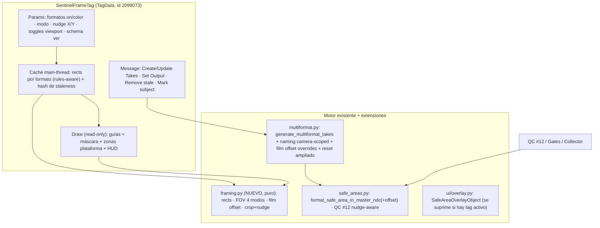
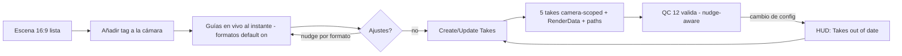

# feat: Sentinel Frame — tag por-cámara de encuadre multi-formato

## Summary

Construir `SentinelFrameTag`: un tag sobre la cámara que se convierte en el **único punto de contacto** del flujo multi-formato — toggles por formato con guías/máscara/HUD en viewport en vivo, modos de compensación FOV con vocabulario nombrado, generación idempotente de Takes con nombres camera-scoped, nudge de encuadre por-formato vía film offset, y zonas de safe-area de plataforma con fecha de vigencia. Cosecha la matemática y el dibujo del prototipo funcional C4DMultiFrame sobre los módulos de Sentinel, reutiliza el motor existente (`generate_multiformat_takes`, `safe_areas`, QC #12), y colapsa las 9 superficies actuales repartidas en 3 pestañas a 1 tag. Las superficies viejas coexisten en v1 (deprecación suave). Target: v1.8.0.

---

## Problem Frame

Hoy el artista que quiere "esta escena en 5 formatos" toca 9 superficies en 3 pestañas: un diálogo modal, dos toggles, un botón de marcado y filas de QC. Los competidores (GSG Social Frame, C4D Frame) demuestran que el patrón ganador es *tag-en-la-cámara + feedback viewport-first + generación one-click* — pero ninguno tiene ajuste de encuadre por-formato, safe-areas de plataforma, ni capa de validación (nadie en C4D/AE/Premiere/FCP detecta automáticamente que un sujeto se sale de cuadro en un formato; todos duplican y scrubean a ojo). Los dolores de fondo están documentados: el film aspect de C4D es global, no por-cámara (Renderosity; mismo hueco en Blender); el sistema de Takes nativo es frágil (overrides que sangran al Master, material overrides borrados al guardar — bugs cross-versión); y reencuadrar moviendo la cámara rompe DOF/motion-blur (Novedge documenta Film Offset como la técnica correcta).

La palanca técnica que desbloquea todo: `TagData.Draw` SÍ funciona en C4D 2026 — nuestra conclusión de v1.5.6 ("registers but never fires") se debió a la ausencia del flag `TAG_IMPLEMENTS_DRAW_FUNCTION` (confirmado: existe en 2026.301, valor 256, verificado por MCP; Maxon staff lo documenta en el foro; C4DMultiFrame registra con él y dibuja). La arquitectura híbrida tag+drawer del WIP viejo sobra.

---

## Requirements

### El tag como punto único

- R1. Un `SentinelFrameTag` sobre una cámara (estándar `Ocamera` o Redshift `Orscamera`) expone en su Attribute Manager: enable+color por formato, modo de composición, toggles de viewport (guías/máscara/zonas de plataforma/HUD), nudge por-formato, y botones Create/Update Takes + Set Output.
- R2. Con el tag habilitado y su cámara como cámara de vista, el viewport muestra en vivo: guías de crop por formato habilitado (color propio), máscara oscurecida opcional fuera del crop, zonas de safe-area de plataforma opcionales, y etiquetas HUD (formato + resolución). Sin re-render, sin diálogo.
- R3. El tag es inerte y seguro fuera de contexto: sobre un no-cámara los botones se deshabilitan con texto de estado; en una máquina sin Sentinel la escena abre con un tag desconocido inofensivo; el tag nunca almacena rutas absolutas de máquina.

### Generación de entregas

- R4. "Create/Update Takes" genera un Take por formato habilitado con RenderData clonado (resolución + output path por-formato) y overrides de cámara según el modo de composición — **idempotente**: re-ejecutar actualiza los takes trackeados, resetea overrides obsoletos (incluido film offset), y reporta created/updated/skipped/orphaned.
- R5. La identidad de los takes generados es **camera-scoped** (`<cámara>_<fmt_id>`, el patrón sufijado que QC #12 ya reconoce) y además **trackeada por BaseLink** en el tag: dos cámaras con tag nunca colisionan; renombrar un take generado no rompe el tracking; un take borrado a mano se detecta y reporta.
- R6. Deshabilitar un formato nunca auto-borra su take: queda huérfano, se reporta en el summary, y un botón explícito "Remove stale takes" (con confirmación) lo elimina.
- R7. "Set Output" (escape hatch) escribe resolución + output path de UN formato en los render settings activos, sin crear Takes.
- R8. Modos de composición: Off / Preserve Vertical / Preserve Horizontal / Crop (focal, cosechados de C4DMultiFrame) / Resize Canvas (aperture, el existente de Sentinel — el único seguro para animaciones con DOF/zoom, y así se comunica en la UI).

### Diferenciadores

- R9. Nudge de encuadre por-formato: sliders X/Y (porcentaje) por formato que desplazan el crop — reflejados en las guías en vivo y aplicados como overrides de film offset en el take generado (nunca moviendo la cámara).
- R10. Las zonas de safe-area de plataforma (insets por-lado de `SAFE_AREA_INSETS`, override-ables por `sentinel_rules.json`) se dibujan dentro de las guías con etiqueta de vigencia ("as of YYYY-MM").
- R11. QC #12 sigue funcionando sin cambios para escenas sin tag, y se vuelve **nudge-aware** para takes trackeados por un tag: el crop desplazado se valida donde realmente está. Con nudge=0 los resultados son idénticos a los actuales (regresión contra los JSON esperados).
- R12. Staleness visible: el tag guarda un hash de params al generar; si la config actual difiere (formato añadido, nudge cambiado), el AM/HUD muestra "Takes out of date — re-run".

### Coexistencia y verificación

- R13. Las superficies viejas siguen funcionando en v1 (MultiFormatDialog, toggle de overlay, botón de marcado). Cuando existe un tag con guías activas, el overlay de escena legacy suprime su dibujo (una sola fuente de verdad visual).
- R14. La matemática nueva (geometría de encuadre, FOV, nudge) vive en un módulo puro con pytest sin `import c4d`; el Draw/registro se verifica en C4D 2026.3 vivo (smoke-probe primero); CLAUDE.md corrige la limitación errónea de TagData.Draw.

---

## Key Technical Decisions

- KTD1 — Tag puro con `TAG_IMPLEMENTS_DRAW_FUNCTION`; el híbrido del WIP sobra. Registro: `RegisterTagPlugin(id=2099073, info=c4d.TAG_VISIBLE | c4d.TAG_EXPRESSION | c4d.TAG_IMPLEMENTS_DRAW_FUNCTION, description="Tsentinelframe", ...)`. Evidencia: flag presente en 2026.301 (verificado por MCP), Maxon staff ("since S22... TAG_IMPLEMENTS_DRAW_FUNCTION", developers.maxon.net/forum/topic/12708), y C4DMultiFrame (registro idéntico, dibuja en 2024+). **El smoke-probe de Draw es la primera verificación de U2**; fallback si fallara (no esperado): tag como data-holder + drawer ObjectData (patrón probado del overlay v1.5.6). La rama WIP `wip/v1.5.8-v1.6.0-combined` queda superseded — se cosechan solo `format_crop_in_master_ndc` y las mejoras de HUD; el resto lo cubre mejor C4DMultiFrame.

- KTD2 — Cosecha de C4DMultiFrame por capas de confianza. LIFT VERBATIM a `plugin/sentinel/framing.py` (puro, pytest): `_inscribed_rect`(208-228), `_offset_rect`(250-262), `_clamp_rect`(231-247), `_format_crop_rect`(274-278), `_scaled_rect`(311-317), `_compensated_focus`(827-836, 4 modos), `_format_camera_framing_values`(897-914, devuelve `(focus, film_x, film_y)`). ADAPTAR: primitivas de dibujo (293-514, incl. máscara con transparencia negativa) y patrón `GetDDescription` (1304-1410). REFERENCIA solo: dispatch de Message y naming/cleanup MF_*. El catálogo v1 son los 5 formatos existentes de `MULTIFORMAT_DEFS` (ids intactos — QC-proven); cinema/print/custom quedan diferidos como adiciones de datos.

- KTD3 — Descripción dinámica (`GetDDescription`) sobre triplete `.res` mínimo. El contenedor `Tsentinelframe.res/.h/.str` existe (registro + nombre localizado, `INCLUDE Texpression`), y los params por-formato se construyen dinámicamente — catálogo extensible por datos sin regenerar recursos, patrón funcional cosechado de C4DMultiFrame. IDs de params en rangos (core 1000s, per-format 1100s+, acciones 3000s, nudge 4000s) + un **param de versión de schema** (un int; un plugin más viejo que abra un tag más nuevo rehúsa Create/Update con aviso).

- KTD4 — Identidad de Takes: nombre camera-scoped + BaseLink. `take_name_for_format` ya produce `{prefijo}_{fmt_id}` para fuentes no-Main y `find_active_multiformat_takes` ya reconoce el patrón sufijado — el tag genera SIEMPRE `<nombre_cámara>_<fmt_id>` (fuente pinneada a Main) y guarda BaseLinks a sus takes en el BaseContainer. Resuelve de un golpe: colisión entre cámaras (el bug destructor del análisis de flujos: el tag de la cámara B "robaría" los takes de A vía `_find_take_by_name` + `SetCamera`), rename (no-evento), y borrado a mano (detectado). Los takes bare-name del diálogo viejo no se tocan (pertenecen a ese flujo; coexistencia).

- KTD5 — El nudge es film offset, y QC #12 lo aprende. Novedge documenta que reencuadrar moviendo la cámara rompe DOF/motion-blur; film offset preserva lente y paralaje — y es lo que `_format_camera_framing_values` ya calcula. La matemática de crop (`format_safe_area_in_master_ndc` y la nueva `format_crop_in_master_ndc`) gana un parámetro de offset opcional con default 0 — **con offset=0 el resultado es bit-idéntico al actual** (regresión contra `expected_*_structured.json`). QC #12, al evaluar un take trackeado por un tag, lee el nudge de ese formato y valida el crop donde realmente está. Para los modos focales (Preserve V/H/Crop) el QC mantiene la interpretación-crop aproximada con el mismo caveat documentado que Resize Canvas hoy.

- KTD6 — Draw de solo-lectura sobre caché precomputada. Draw corre en thread de dibujo y se invoca por drawpass y por BaseDraw: (a) gate `bd.GetDrawPass() != c4d.DRAWPASS_OBJECT → return True` (si no, máscara dibujada 3-4×); (b) filtro `bd.GetSceneCamera(doc) == cámara_host`; (c) `bd.GetSafeFrame()` por-llamada, nunca cacheado por-documento; (d) los rects/insets (que dependen de `sentinel_rules.json`) se precomputan en Message/Execute en main thread y se invalidan con la caché de reglas existente — Draw solo lee. Máscara: `bd.SetTransparency(negativo)` (transparencia real). HUD: `bd.DrawHUDText` (patrón oficial py-ocio_node_2025). Prioridad de expresión: `PRIORITYVALUE_CAMERADEPENDENT`.

- KTD7 — Botones vía `MSG_DESCRIPTION_COMMAND` con guard y undo manual. Patrón oficial (py-licensing_2026): `GeIsMainThread()` antes de mutar, `StartUndo/EndUndo` explícito + `EventAdd`. Takes API solo desde Message (main thread), nunca desde Execute (expression thread). `GetDEnabling` grisa sub-params de formatos deshabilitados y los botones sobre no-cámaras.

- KTD8 — Coexistencia con supresión del overlay legacy. Las superficies viejas no se retiran en v1. Regla de una-sola-verdad-visual: si el documento contiene algún `SentinelFrameTag` con guías habilitadas, `SafeAreaOverlayObject.Draw` retorna temprano (chequeo barato cacheado en `_overlay_state`, refrescado en los mismos puntos que hoy); el toggle del panel lo indica. El botón "Generate Format Takes..." del Render tab gana un vecino "Add Sentinel Frame to camera" que se convierte en la vía recomendada.

- KTD9 — Mapeo de params de cámara como entregable verificado. `CAMERA_FOCUS=500` y `CAMERAOBJECT_APERTURE=1006` funcionan en ambos tipos (ya probado en v1.5.5); los IDs de film offset (`CAMERAOBJECT_FILM_OFFSET_X/Y`) deben verificarse en `Orscamera` durante U1/U4 (tabla de mapeo en el código con comentario de verificación). `_reset_camera_dimensions_to_native` (multiformat.py:268-310) se extiende para resetear también film offset — hoy no lo cubre y un tag cortado/pegado a otra cámara dejaría offsets huérfanos en la cámara anterior (el tag guarda BaseLink a su última cámara para limpiarla en re-run).

---

## High-Level Technical Design

Arquitectura (el tag es front-end; el motor existente no cambia salvo extensiones aditivas):

Flujo del artista (objetivo: 2 clicks del estado "escena 16:9 acabada" a "5 takes listos con guías en vivo"):

---

## Implementation Units

### Phase 1 — Núcleo puro (pytest, sin C4D)

### U1. `framing.py`: geometría, FOV y nudge cosechados

- Goal: toda la matemática nueva como módulo puro con tests, cosechada de C4DMultiFrame + WIP.
- Requirements: R8, R9, R11 (base), R14.
- Dependencies: ninguna.
- Files: `plugin/sentinel/framing.py` (nuevo), `plugin/sentinel/safe_areas.py` (extensión aditiva), `tests/test_framing.py` (nuevo).
- Approach: lift verbatim de C4DMultiFrame (KTD2): rects inscritos/offset/clamp/crop/scaled + `compensated_focus` (4 modos) + `format_camera_framing_values` → `(focus, film_x, film_y)`. Cosechar `format_crop_in_master_ndc` del WIP (commit 95c181b). Extender `format_safe_area_in_master_ndc` (safe_areas.py:76) con parámetro de offset opcional default 0 (KTD5) — el shift del crop region, clampado al frame. Catálogo: los 5 `MULTIFORMAT_DEFS` intactos. Tabla de mapeo de params de cámara (KTD9) como constantes documentadas.
- Patterns to follow: C4DMultiFrame.pyp:208-317, 827-958 (fuente de harvest); `sentinel/safe_areas.py` (estilo de módulo puro); WIP 95c181b `format_crop_in_master_ndc`.
- Test scenarios:
  - Rect inscrito: 9:16 en frame 16:9 → rect centrado con ancho = alto×9/16; 16:9 en 16:9 → frame completo (degenerado, sin división por cero).
  - Offset/clamp: nudge +10% X desplaza el rect y clampa en el borde; offset=0 → idéntico al rect centrado.
  - `compensated_focus`: Preserve Vertical 16:9→9:16 con focal 36 → ~113.7 (×3.16); Preserve Horizontal → sin cambio de focal en ese eje; Off → focal intacta.
  - `format_camera_framing_values`: nudge (5%, -3%) → film offset proporcional correcto por modo.
  - **Regresión crítica**: `format_safe_area_in_master_ndc(..., offset=0)` produce resultados idénticos a la versión actual para los 5 formatos (comparar contra valores de los fixtures existentes).
  - Todo vía `importlib` sin C4D.
- Verification: `pytest tests/test_framing.py` verde; los tests QC existentes intactos (70+ actuales siguen pasando); cero `import c4d` en framing.py.

### U2. Registro del tag + descripción + params

- Goal: `SentinelFrameTag` registrado y visible, con su superficie de params completa y comportamiento seguro fuera de contexto.
- Requirements: R1, R3, R14 (smoke-probe).
- Dependencies: U1.
- Files: `plugin/sentinel/ui/frame_tag.py` (nuevo), `plugin/sentinel_panel.pyp` (registro), `plugin/res/description/Tsentinelframe.res|.h` (nuevos), `plugin/res/strings_us/description/Tsentinelframe.str` (nuevo), `plugin/res/c4d_symbols.h` (si aplica).
- Approach: registro con los tres flags (KTD1, id 2099073). Triplete `.res` mínimo + `GetDDescription` dinámico (KTD3, patrón C4DMultiFrame:1304-1410): grupo master (enabled, modo composición LONG CYCLE, toggles viewport), grupo por formato (enable BOOL, color COLOR, nudge X/Y REAL sliders PERCENT, colapsable), grupo acciones (BUTTONs), param schema-version. `GetDEnabling`: sub-params grises si formato off; botones grises sobre no-cámara (host resuelto estilo `_tag_camera_host` de C4DMultiFrame:173, aceptando `Ocamera` + `Orscamera`). `Init` fija `PRIORITYVALUE_CAMERADEPENDENT` y defaults (5 formatos on, modo Off, guías on).
- Patterns to follow: registro de `SafeAreaOverlayObject` en el `.pyp` (guard de disponibilidad + fallo no-fatal); C4DMultiFrame `GetDDescription`; triplete `safearea_overlay` en `plugin/res/`.
- Test scenarios:
  - Test expectation: la superficie de params es C4D-bound — verificación en vivo. El helper puro de resolución de host (dado un objeto, ¿es cámara válida?) sí lleva pytest con el fake-c4d (`Ocamera` → válido, `Onull` → inválido, `Orscamera` → válido).
  - **Smoke-probe (primera verificación, vía MCP)**: tag sobre una cámara en 2026.3 → contador en Draw > 0 tras forzar redraw. Si no dispara → parar y activar el fallback de KTD1 antes de continuar.
  - En vivo: tag sobre null → botones grises + texto de estado; AM muestra los grupos; defaults correctos.
- Verification: plugin carga sin errores con el tag registrado; smoke-probe de Draw positivo; AM completo en C4D 2026.3.

### U3. Draw: guías, máscara, zonas de plataforma y HUD

- Goal: feedback viewport-first completo, seguro en threading y multi-viewport.
- Requirements: R2, R10 (dibujo), R12 (indicador HUD), R13 (supresión legacy).
- Dependencies: U1, U2.
- Files: `plugin/sentinel/ui/frame_tag.py`, `plugin/sentinel/ui/overlay.py` (supresión), `tests/test_framing.py` (helpers de layout puros si los hay).
- Approach: KTD6 al pie de la letra: gate de drawpass, filtro de cámara-host, `GetSafeFrame` por-llamada, caché main-thread de rects (invalidada junto a la caché de reglas y al cambiar params — recomputada en Message/Execute). Dibujo por formato habilitado: rect de guía (color del formato, cosechando `_draw_rect`/`_draw_line`), máscara opcional fuera de la intersección (transparencia negativa, `_draw_mask` C4DMultiFrame:478-514), zonas de plataforma dentro de la guía (insets de rules con etiqueta "as of"), HUD por formato (id + resolución) + línea de staleness ("Takes out of date") cuando el hash difiere. Supresión legacy (KTD8): `SafeAreaOverlayObject.Draw` consulta un flag en `_overlay_state` que el refresco existente actualiza (¿hay tag con guías on en el doc?).
- Patterns to follow: `SafeAreaOverlayObject.Draw` (overlay.py:177-247 — SetMatrix_Screen, mapeo NDC→píxel, GetSafeFrame); C4DMultiFrame primitivas de dibujo; py-ocio_node_2025 (`DrawHUDText`, `LineZOffset`).
- Test scenarios:
  - Puros (si se factoriza el layout): NDC→píxel con letterbox; intersección de N formatos para la máscara.
  - En vivo (checklist): guías visibles solo cuando la cámara del tag es la de la vista; 4-up con cámaras distintas → cada viewport correcto; máscara sin doble-oscurecimiento (gate de drawpass funcionando); zonas de plataforma dentro de guías; HUD legible; overlay legacy se apaga al activar guías del tag y vuelve al desactivarlas; playback fluido con 5 formatos + máscara.
- Verification: checklist en vivo en C4D 2026.3 (MCP para lo automatizable: estado del flag de supresión, contadores); sin regresión del overlay legacy cuando no hay tag.

### Phase 2 — Acciones

### U4. Motor de generación: naming camera-scoped, film offset y tracking

- Goal: extensiones aditivas al motor para que el tag genere takes idempotentes, trackeados y con nudge aplicado.
- Requirements: R4, R5, R6 (motor), R9 (aplicación), R11 (datos para QC).
- Dependencies: U1.
- Files: `plugin/sentinel/multiformat.py`, `tests/` (test nuevo o ampliación del existente de multiformat si lo hay; los helpers puros a `tests/test_framing.py`).
- Approach: `generate_multiformat_takes` gana en `options`: `name_prefix` (nombre de cámara → takes `<prefijo>_<fmt_id>`), `film_offsets` (por formato → overrides `CAMERAOBJECT_FILM_OFFSET_X/Y` vía `FindOrAddOverrideParam`+`SetParameter` explícito, el patrón v1.5.5), y los modos focales nuevos (Preserve V/H/Crop → override de `CAMERA_FOCUS` con `compensated_focus` de U1). `_reset_camera_dimensions_to_native` se amplía con film offset (KTD9). El reporte gana `orphaned` (takes trackeados cuyo formato ya no está habilitado) y `missing` (BaseLink muerto). La verificación de mapeo RS (KTD9) se hace aquí contra `Orscamera` real.
- Patterns to follow: el propio orquestador (multiformat.py:313-547) — mismo estilo de opciones, undo wrapping, reporte; el fix v1.5.5 (`SetParameter` explícito tras `FindOrAddOverrideParam`).
- Test scenarios:
  - Con fake-c4d: `name_prefix="CamA"` → nombres `CamA_16x9`...; sin prefijo → bare (compat diálogo viejo intacta).
  - `film_offsets={"9x16": (0.05, -0.03)}` → el override se solicita para ese take y no para los demás.
  - Reset ampliado: cámara con film offset residual → tras generar en modo Off, offset a 0.
  - Reporte: formato deshabilitado con take trackeado → aparece en `orphaned`, nunca borrado.
  - En vivo: re-run tras rename manual de un take trackeado → BaseLink lo encuentra, no duplica; dos cámaras con tag → dos sets de takes sin colisión; QC #12 descubre los takes sufijados (ya soportado — verificar).
- Verification: pytest verde; regresión del diálogo viejo (genera bare names idéntico a hoy); recorrido en vivo multi-cámara.

### U5. Botones del tag: Create/Update, Set Output, Remove stale, staleness

- Goal: cablear las acciones del tag al motor con el ciclo de vida completo (adopción, huérfanos, staleness).
- Requirements: R4, R5, R6, R7, R12.
- Dependencies: U2, U4.
- Files: `plugin/sentinel/ui/frame_tag.py`.
- Approach: `Message` con `MSG_DESCRIPTION_COMMAND` (KTD7: `GeIsMainThread` + undo + EventAdd). Create/Update: leer params → llamar al motor con `name_prefix`+`film_offsets`+modo → guardar BaseLinks y el hash de params → summary dialog (created/updated/skipped/orphaned/missing, y "adopted" si un take camera-scoped ya existía). Set Output: escribe resolución+path del formato elegido en el RenderData activo (sin takes). Remove stale: lista huérfanos → confirmación → borrado con undo. Staleness: hash de (formatos on, nudge, modo, catálogo) comparado en `Execute`/CoreMessage barato → flag que Draw lee (HUD) y `GetDDescription` muestra. El tag guarda BaseLink a su última cámara para limpiar overrides al re-run tras cut/paste (KTD9).
- Patterns to follow: `_show_baseline_actions` (undo + invalidación + refresh); summary dialog del Multi-Format actual (panel.py:3880-3990).
- Test scenarios:
  - El cálculo del hash de staleness es puro → pytest: mismo config → mismo hash; cambiar un nudge → difiere.
  - En vivo (checklist): click Create con 3 formatos → 3 takes + summary; deshabilitar 1 + re-run → orphaned reportado, take intacto; Remove stale → confirmación → borrado y un solo undo; Set Output → render settings activos cambiados sin takes; todos-los-formatos-off → botón gris; cambiar nudge → HUD "out of date" → re-run lo limpia.
- Verification: recorrido en vivo completo del ciclo; Cmd+Z único por acción (menú Edit, no `doc.DoUndo()`).

### Phase 3 — QC y diferenciadores

### U6. QC #12 nudge-aware + marcado desde el tag

- Goal: la validación entiende el nudge; el marcado de sujetos es accesible desde el tag.
- Requirements: R11, R10 (consumo QC de insets), + botón de conveniencia.
- Dependencies: U1, U4, U5.
- Files: `plugin/sentinel/safe_areas.py`, `plugin/sentinel/ui/frame_tag.py`, `tests/test_safe_area_math_helpers.py` (ampliación).
- Approach: `_scan_cross_aspect_safe_area` — al precomputar el rect de cada formato (safe_areas.py:783-786), buscar si el take está trackeado por un tag (BaseLink inverso o lookup por doc) y pasar su nudge al offset de `format_safe_area_in_master_ndc` (U1). Sin tag → offset 0 → comportamiento idéntico (regresión de fixtures obligatoria). Botón "Mark selected as safe-area subject" en el tag → reusa `_toggle_safe_area_mark`. Documentar el caveat de los modos focales (aproximación crop-interpretation, como Resize Canvas hoy).
- Patterns to follow: la resolución de takes existente (`find_active_multiformat_takes`); el botón de Tools actual (panel.py:3622-3692).
- Test scenarios:
  - Puro: rect con offset (0.05, 0) → violación detectada en el borde correcto (un bbox que pasaba centrado ahora viola por la derecha).
  - **Regresión crítica**: fixtures `violating.c4d`/`clean.c4d` (sin tags) → resultados byte-idénticos a los JSON esperados.
  - En vivo: cubo marcado que cabe centrado en 9:16 → nudge +10% X → QC #12 lo reporta; quitar nudge + re-run → verde.
- Verification: pytest + runner de fixtures idénticos sin tag; caso con nudge validado en vivo.

### Phase 4 — Coexistencia, migración y docs

### U7. Panel, supresión, CLAUDE.md y cierre

- Goal: puerta de entrada visible, una sola verdad visual, documentación corregida y destino del WIP resuelto.
- Requirements: R13, R14.
- Dependencies: U3, U5, U6.
- Files: `plugin/sentinel/ui/panel.py`, `plugin/sentinel/ui/ids.py`, `CLAUDE.md`, `README.md`, `ROADMAP.md`.
- Approach: botón "Add Sentinel Frame to camera" en el Render tab junto al diálogo viejo (crea el tag en la cámara activa/seleccionada con defaults, o selecciona el existente); hint de deprecación suave en el diálogo viejo ("Prefer the Sentinel Frame tag..."). Verificar la supresión del overlay legacy end-to-end (U3). CLAUDE.md: corregir la known-limitation de TagData.Draw (documentar el flag y la causa raíz del probe v1.5.6) + añadir Sentinel Frame a What Works/UI layout. README: sección nueva. ROADMAP: marcar v1.5.8/v1.6.0-WIP como superseded (rama se cierra tras cosechar; anotar qué se cosechó). Bump a v1.8.0 en el release (fuera de este plan si gates aún no ha salido como v1.7.0).
- Patterns to follow: botones existentes del Render tab; el estilo de known-limitations de CLAUDE.md.
- Test scenarios:
  - Test expectation: none — unidad de wiring+docs; la verificación es el checklist de humo.
  - En vivo: botón crea/selecciona el tag; escena SIN tag → overlay legacy y diálogo viejo funcionan exactamente como en v1.7; escena CON tag → overlay suprimido con hint.
- Verification: checklist de humo completa (4 tabs, overlay, diálogo viejo, tag end-to-end); docs actualizados; regresión pytest completa verde.

---

## Scope Boundaries

### Deferred to Follow-Up Work

- Catálogo cinema (2.39/1.85/2:1) y print (A4/A3/Letter/Tabloid) — adiciones de datos sobre el catálogo; requieren decidir ids compatibles con el matching por nombre de QC.
- Formatos custom (ratio/resolución definidos por el usuario) — la descripción dinámica lo deja barato; fuera de v1.
- Slice-takes (tiles) de C4DMultiFrame — útil pero ortogonal al problema multi-formato.
- Check QC dedicado "Take override drift" (¿los overrides siguen aplicados tras guardar?) — el pain está documentado (bugs de C4D); v1 lo mitiga con el re-run idempotente y el staleness hash; un check del registro es candidato a QC #13.
- Retirada definitiva de MultiFormatDialog + toggle overlay + botón Tools (v1 = coexistencia; retirar cuando el tag esté validado en producción).
- Presets de safe-area por plataforma versionados/actualizables (bundle con fechas por plataforma, actualización desde ruleset compartido).
- Cámaras stage/ortográficas y multi-tag avanzado (varias configs por cámara).

### Outside this feature's scope

- Cambios al motor QC, score, baseline o gates — solo se consume (la extensión de `format_safe_area_in_master_ndc` es aditiva con default idéntico).
- Reescritura del overlay legacy o del diálogo viejo — coexisten intactos.
- Post-Render Validation (I1) — sigue siendo la otra línea del roadmap, ortogonal.

---

## Risks & Dependencies

- **Smoke-probe primero (KTD1/U2):** todo lo visual depende de que Draw dispare con los tres flags. Evidencia fuerte (flag verificado + C4DMultiFrame funcional + confirmación de Maxon staff), pero se verifica ANTES de construir U3+; fallback definido (data-holder + ObjectData drawer). No registrar plugins en runtime vía MCP exec (crashea el executor — probar con el plugin cargado al arranque).
- **Colisión de takes multi-cámara (KTD4):** el bug destructor del análisis de flujos. Mitigado por naming camera-scoped + BaseLinks; test en vivo con 2 cámaras obligatorio en U4.
- **QC silenciosamente mal con nudge (KTD5):** peor que no tener QC. Mitigado: offset default 0 con regresión byte-idéntica de fixtures; caso con nudge validado en vivo (U6); caveat de modos focales documentado.
- **Params de RS camera (KTD9):** los IDs de film offset en `Orscamera` deben verificarse empíricamente (U4); si difieren, la tabla de mapeo los aísla.
- **Take system frágil (pain #1):** overrides pueden perderse al guardar (bug C4D). Mitigación v1: re-run idempotente barato + staleness hash + reporte `missing`; check dedicado diferido.
- **Rendimiento del Draw:** 5 formatos × máscara × multi-viewport × drawpasses. Mitigado por el gate de drawpass, el filtro de cámara y la caché precomputada (KTD6); si la máscara pesa, es toggle-able (off por defecto es opción).
- **Descripción dinámica (KTD3):** menos común que `.res` estático en el codebase — el patrón cosechado de C4DMultiFrame está probado, pero la primera integración con `GetDEnabling` + undo de params en C4D 2026 puede tener fricción; presupuestar iteración en U2.
- **Coexistencia visual (KTD8):** overlay legacy + guías del tag dibujando a la vez confundiría; la supresión debe verificarse en ambos sentidos (activar/desactivar guías del tag).

---

## Sources & Research

- Análisis UX de competidores (sesión 2026-07-05): GSG Social Frame (tag+Takes, un modo FOV opaco, sin nudge/QC) y C4D Frame (tag, 4 modos FOV nombrados, T/C/R por ratio, €9.99; sin nudge/safe-areas/QC). Huecos compartidos verificados: nudge por-formato, zonas de plataforma, validación, compensación segura para animación.
- Inventario C4DMultiFrame (sesión): `../11 C4D DEV/C4DMultiFrame/C4DMultiFrame.pyp` (1700 líneas, funcional 2024+, registro con los tres flags en 1688-1691) — plan de cosecha por capas con líneas citadas en KTD2.
- Brief SDK C4D 2026 (sesión, con citas): flag `TAG_IMPLEMENTS_DRAW_FUNCTION` (docs TAG consts 2026.1; developers.maxon.net/forum/topic/12708; verificado vivo por MCP en 2026.301 = 256); firma y threading de Draw; `SetTransparency` negativa; `DrawHUDText` (py-ocio_node_2025.pyp:284); `MSG_DESCRIPTION_COMMAND` (py-licensing_2026.pyp:199); triplete `.res` (py-look_at_camera); `Orscamera=1057516`.
- Pain points (sesión, con URLs): Takes frágiles (Creative COW; Cineversity 965; bug de material overrides en Autodesk forums); film offset como técnica correcta (Novedge); film aspect global no por-cámara (Renderosity; Blender devtalk 40317); recomposición manual (Pixflow); naming RESOLUTION_ASPECT (LiftGammaGain); safe-zones importados a mano y caducos (Kreatli/Ignite).
- Análisis de flujos (sesión): 21 gaps rankeados — los 6 plan-blocking resueltos en KTD4 (identidad de takes), KTD5 (nudge-aware QC), KTD1 (smoke-probe), KTD9 (RS params + reset film offset), R6 (orphan policy), KTD8 (supresión overlay).
- Código propio: `plugin/sentinel/multiformat.py` (`generate_multiformat_takes:313-547`, `take_name_for_format:187`, `_reset_camera_dimensions_to_native:268-310`, `compute_target_aperture:115-135`); `plugin/sentinel/safe_areas.py` (`format_safe_area_in_master_ndc:76`, `find_active_multiformat_takes:446`, `_scan_cross_aspect_safe_area:700`, `SAFE_AREA_INSETS:32`); `plugin/sentinel/ui/overlay.py` (`SafeAreaOverlayObject:164`, `_overlay_state:143`); WIP 95c181b (`format_crop_in_master_ndc`); escalera de tests (`tests/conftest.py`, fixtures + expected JSONs).
